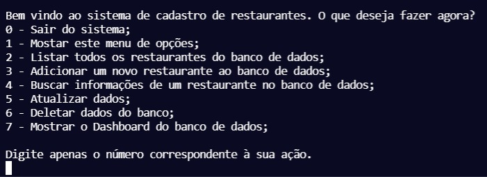

# Desenvolvendo um banco de dados de restaurantes
Criando um banco de dados de restaurantes utilizando Python base

Este programa é um sistema de registro de restaurantes em banco de dados. Nele você pode adicionar, buscar, atualizar, remover e visualizar um Dashboard com insights sobre todos as informações do banco de dados.

#### Requeriments

$ pip install matplotlib

## Utilização

$ python main.py

